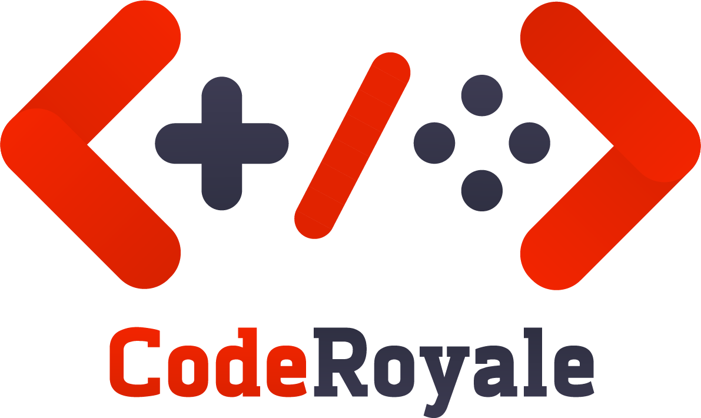
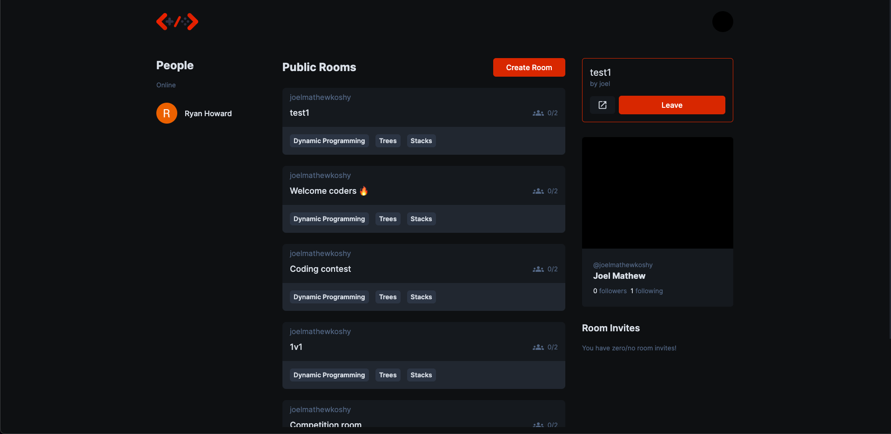
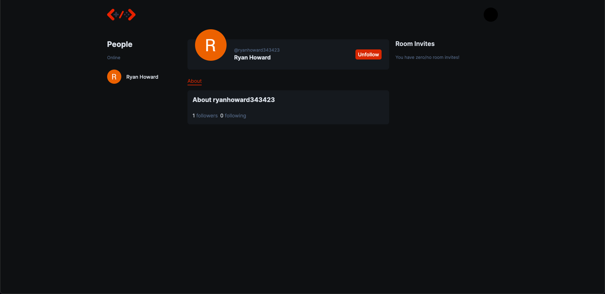
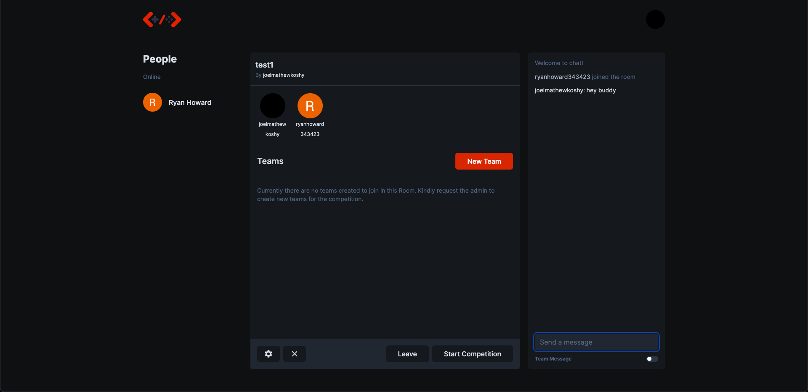
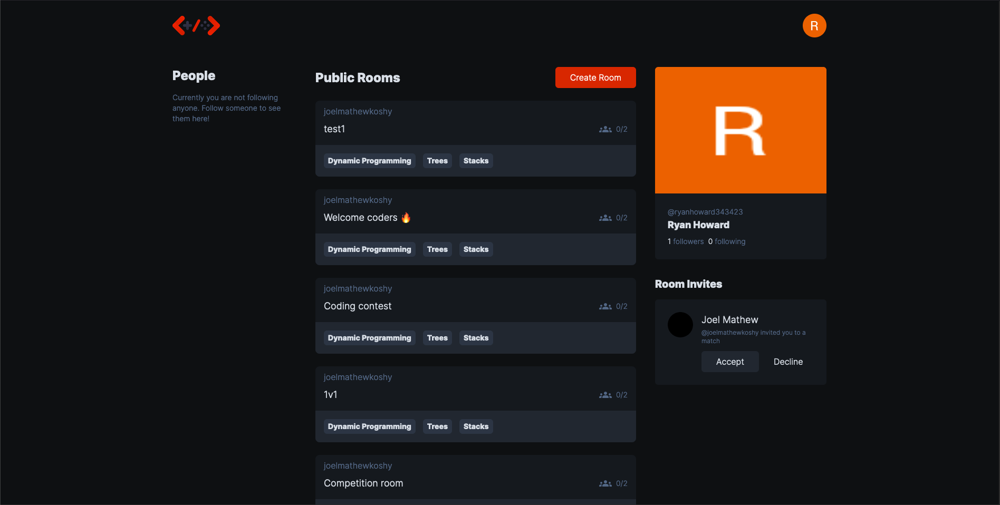
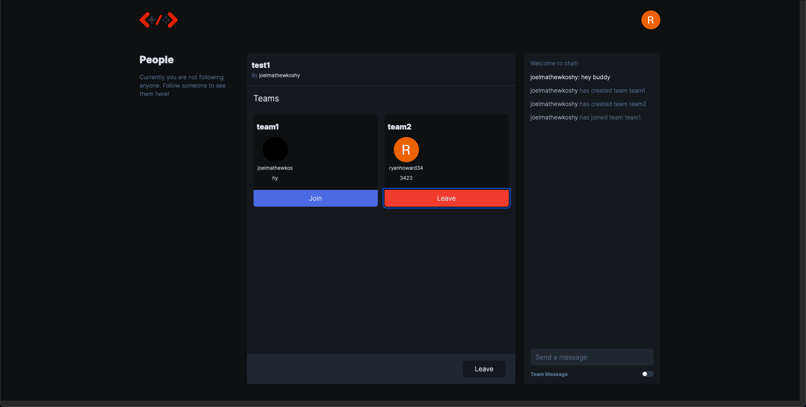

    

  <strong>Building a fun environment for folks to compete in coding contests</strong>

  

<h3 align="center">
  <a href="https://github.com/CodeRoyale/lobby/blob/develop/CONTRIBUTING.md">Contribute</a>
   · 
  <a href="https://discord.gg/aCKem4h8te">Community</a>
</h3>

---

## Structure

| Module                                                                |                            Description                            |
| :-------------------------------------------------------------------- | :---------------------------------------------------------------: |
| [frontend](https://github.com/CodeRoyale/CodeRoyale/tree/v2/frontend) |                      React (Nextjs) frontend                      |
| [lobby](https://github.com/CodeRoyale/CodeRoyale/tree/v2/lobby)       |            WebSocket server for managing competitions             |
| [api](https://github.com/CodeRoyale/CodeRoyale/tree/v2/api)           | Graphql API for handling authentication and serving question data |
| [common](https://github.com/CodeRoyale/CodeRoyale/tree/v2/common)     |                          Common TS types                          |

## Screenshots

Discover public rooms and compete in a contest easily!

Public profile page with ability to follow folks and create connections

Room page

Invite connections to join a room!

Create teams

