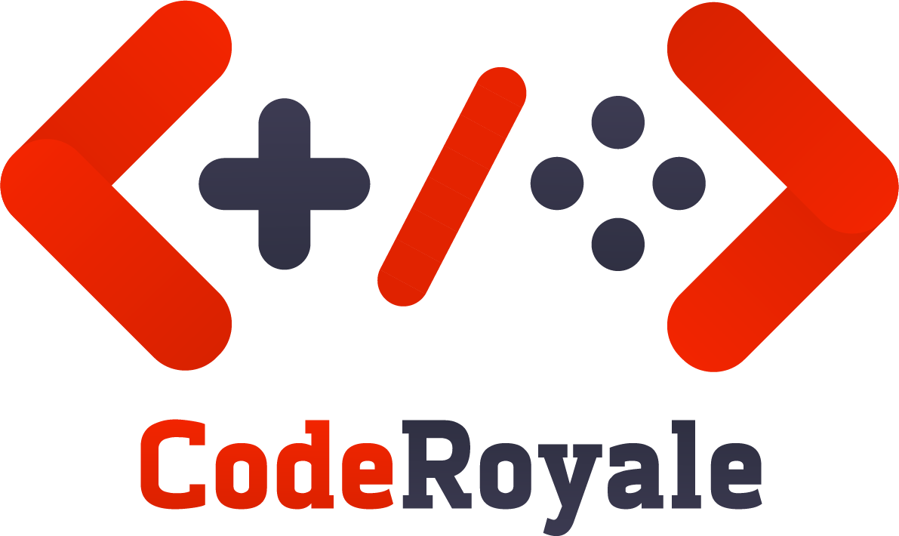

<a href="https://coderoyale.netlify.app">

</a>

  <strong>Making competitive programming more fun and better!</strong>

  

<h3 align="center">
  <a href="https://github.com/CodeRoyale/questionAPI/blob/develop/CONTRIBUTING.md">Contribute</a>
   · 
  <a href="https://discord.gg/aCKem4h8te">Community</a>
   · 
  <a href="https://coderoyale-questionapi.herokuapp.com/docs">Documentation</a>
</h3>

---

## Structure

| Module           | Description |
| :--------------- | :---------: |
| [frontend](https://github.com/CodeRoyale/frontend) |    React frontend     |
| [lobby](https://github.com/CodeRoyale/lobby)    |    WebSocket server for managing competitions    |
| [userAPI](https://github.com/CodeRoyale/userAPI)    |     JWT authentication server     |
| [questionAPI](https://github.com/CodeRoyale/questionAPI)    |    REST API serving questions and test cases     |

## Branches

- develop: This contains the latest code. All the contributing PRs must be sent to this branch.
- prod: This branch contains the code running at production.

## Contributions

CodeRoyale/questionAPI is open to contributions, but we recommend creating an issue for letting us know about the feature you are working upon.
Please read [CONTRIBUTING.md](https://github.com/CodeRoyale/questionAPI/blob/develop/CONTRIBUTING.md)

## Reviewers

- [@sastaachar](https://github.com/sastaachar)
- [@naveen-770](https://github.com/naveen-770)
- [@donald0109](https://github.com/donald0109)
- [@SAchu47](https://github.com/SAchu47)
- [@sanithps98](https://github.com/sanithps98)
- [@rishi0904](https://github.com/rishi0904)

## How to run locally
Check out [SETUP.md](https://github.com/CodeRoyale/questionAPI/blob/develop/SETUP.md)

## Why did we make this?

The goal of CodeRoyale is to create a Competitive Programming platform, where users can have coding battle with friends, random users and team battles to show case your programming skills.

